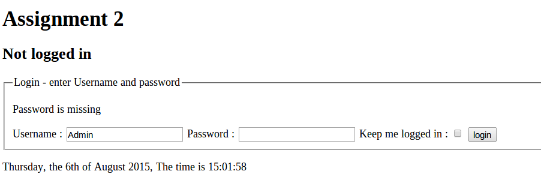
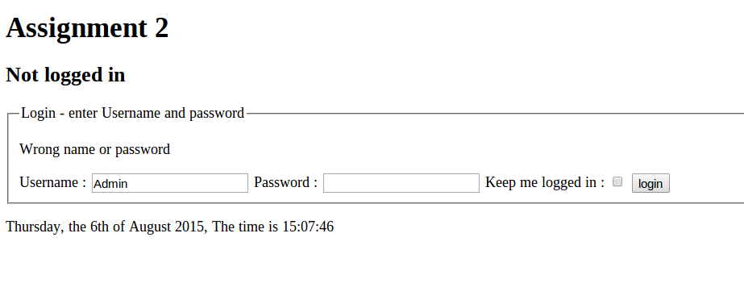

#Testcases

##Test case 1.1, Navigate to Page 
Normal navigation to page, page is shown.

Todays date is shown as: [Day of week], the [day of month numeric]th of [Month as text] [year 4 digits]. The time is [Hour]:[minutes]:[Seconds].
Example: "Monday, the 8th of July 2015, The time is 10:59:21".

###Input:
 * Clear existing cookies
 * Navigate to site.
 
###Output:
 * The text "Not logged in", is shown.
 * A form for login is shown
 * Todays date and time is shown in correct format.
 

##Test case 1.2: Failed login without any entered fields
Make sure login cannot happen without entering any fields

###Input:
 * Testcase 1.1
 * Make sure both username and password is empty
 * Press "login" button
 
###Output:
 * The text "Not logged in", is shown.
 * Feedback: “Username is missing” is shown
 * A form for login is shown

##Test case 1.3: Failed login with only username
Make sure login cannot happen without entering both fields

###Input:
 * Testcase 1.1
 * Enter a username "Admin" and let password be empty
 * Press "login" button
 
###Output:
 * The text "Not logged in", is shown.
 * Feedback: “Password is missing” is shown
 * A form for login is shown.
 * "Admin" is filled in as username

##Test case 1.4: Failed login with only password
Make sure login cannot happen without entering both fields

###Input:
 * Testcase 1.1
 * Enter a password "Password" and let UserName be empty
 * Press "login" button
 
###Output:
 * The text "Not logged in", is shown.
 * Feedback: “Username is missing” is shown
 * A form for login is shown.
 * Password is empty

##Test case 1.4: Failed login with wrong password but existing username
Make sure login cannot happen without correct password

###Input:
 * Testcase 1.1
 * Enter a password "password" <-(NOTE THE LITTLE 'p') and let UserName be "Admin"
 * Press "login" button
 
###Output:
 * The text "Not logged in", is shown.
 * Feedback: "Wrong name or password" is shown
 * A form for login is shown.
 * Password is empty
 * "Admin" is filled in as username

