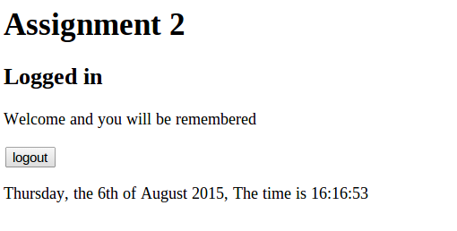
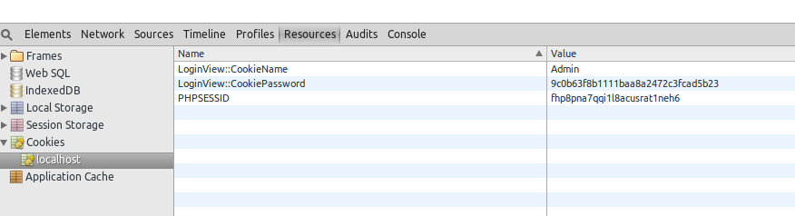

#Testcases

##Test case 3.1, Login with "Keep me logged in" 
Normal navigation to page, page is shown.

###Input:
 * Clear existing cookies
 * Navigate to site.
 * Test case 1.1 Navigate to page
 * Enter Username "Admin"
 * Enter Password "Password"
 * Select "Keep me logged in"
 
###Output:
 * The text "Logged in", is shown.
 * The feedback "Welcome and you will be remembered" is shown
 * A logout button is shown
 

