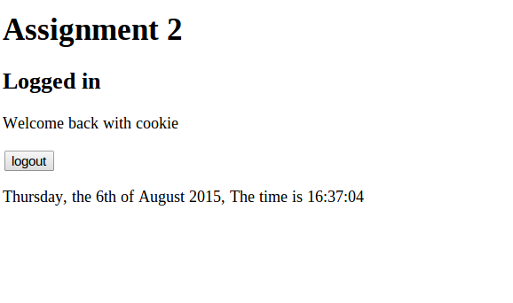
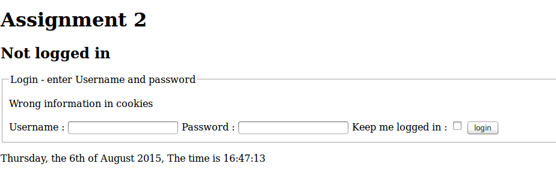

#Testcases

##Test case 3.1, Login with "Keep me logged in" 
Normal navigation to page, page is shown.

###Input:
 * Clear existing cookies
 * Navigate to site.
 * Test case 1.1 Navigate to page
 * Enter Username "Admin"
 * Enter Password "Password"
 * Select "Keep me logged in"
 
###Output:
 * The text "Logged in", is shown.
 * The feedback "Welcome and you will be remembered" is shown
 * A logout button is shown
 * Client has cookies for username and password, username is "Admin", password is a random string, unreadable
 

##Test case 3.2, Reload removes feedback

###Input:
 * Test case 3.1
 * Reload page
 
###Output:
 * The text "Logged in", is shown.
 * No feedback is shown
 * A logout button is shown
 * Client has cookies for username and password, username is "Admin", password is a random string, unreadable
 

##Test case 3.3, Login by cookies

###Input:
 * Test case 3.1
 * Stop the session by closing the browser window (or remove the session cookie called "PHPSESSID" )
 * (Re)load the page before the cookies end date
 
###Output:
 * The text "Logged in", is shown.
 * Feedback "Welcome back with cookie" is shown
 * A logout button is shown
 * Client still has cookies for username and password, username is "Admin", password is a random string, unreadable
 

##Test case 3.4, Failed login by manipulated cookies
Make sure login attempts fail if cookies are manipulated.

###Input:
 * Test case 3.1
 * Remove the PHPSESSID cookie
 * Change the content of the password cookie (For example by FireBug plugin for Firefox)
 * Reload the page by selecting URL and press Enter

###Output
 * Wrong information in cookies
 * The text "Not logged in" is shown
 * Cookies for login is removed (only PHPSESSID cookie is left)
 

